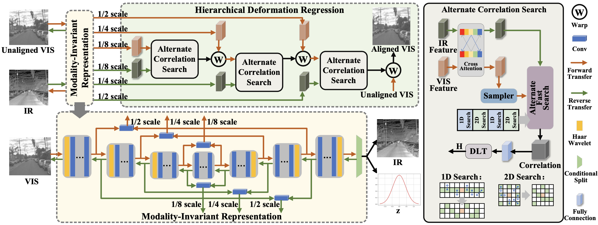

# HR4IR
This is an implement of the HR4IR,
**“Breaking Modality Disparity: Harmonized Representation for Infrared and Visible Image Registration"**, 
Zhiying Jiang, Zengxi Zhang, Jinyuan Liu, Xin Fan, Risheng Liu*, 2024, under review.

## Overview

## Download
Download the pre-trained model and put it in models/

- [Google Drive](https://drive.google.com/drive/folders/1JEQ7KTazBz89K4Keo8CRNv00fbilcUGr?usp=sharing)

​

## Contact
Should you have any question, please contact [Zhiying Jiang].

[Zhiying Jiang]:zyjiang@gmail.com
